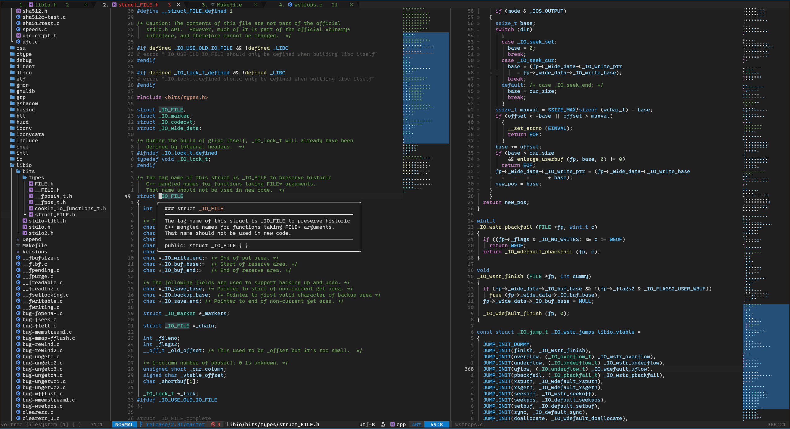

# micronoyau.nvim

A personal Neovim configuration built around a VSCode-like aesthetic.



## Structure

```
~/.config/nvim/
├── init.lua                      # Entry point
└── lua/micronoyau/
    ├── init.lua                  # Bootstrap: leader key, module loading
    ├── options.lua               # Editor options
    ├── keymaps.lua               # Global keymaps (non-plugin)
    ├── lazy.lua                  # Plugin manager + all plugin configs
    └── minimap_viewport.lua      # Custom minimap viewport highlight handler
```

## Plugins

### Theme & UI
- **vscode.nvim** — VSCode dark/light colorscheme (`<leader>th` to toggle)
- **lualine.nvim** — Statusline with mode, branch, diagnostics, and file info
- **bufferline.nvim** — Buffer tabs with ordinal numbers and LSP diagnostic indicators
- **which-key.nvim** — Keybinding popup hints (300ms timeout)
- **noice.nvim** — Floating cmdline, search, and notifications
- **indent-blankline.nvim** — Indent guides with scope highlighting
- **smear-cursor.nvim** — Animated cursor movement
- **neoscroll.nvim** — Smooth scrolling with sine easing
- **neominimap.nvim** — VSCode-style minimap with a custom viewport indicator

### File Navigation
- **oil.nvim** — Edit the filesystem like a buffer (floating, `<leader>ef`)
- **neo-tree.nvim** — Sidebar file tree with git status (`<leader>ee`)
- **telescope.nvim** — Fuzzy finder with fzf-native and ripgrep backend

### LSP & Completion
- **nvim-lspconfig** + **mason.nvim** — LSP client and server installer
- **nvim-cmp** — Completion engine with LSP, buffer, path, and snippet sources
- **LuaSnip** + **friendly-snippets** — Snippet engine and community snippets
- **lspkind.nvim** — VSCode-style pictograms in the completion menu
- **conform.nvim** — Manual formatting (no format-on-save)

Auto-installed LSP servers: `bashls`, `clangd`, `dockerls`, `html`, `jsonls`, `lua_ls`, `marksman`, `pylsp`, `pyright`, `rust_analyzer`

Formatters: `stylua`, `black`, `prettier`, `rustfmt`, `clang-format`

### Git
- **gitsigns.nvim** — Inline git signs, hunk preview, line blame
- **vim-fugitive** — Full `:Git` command integration
- **vim-flog** — Git log graph viewer (`:Flogsplit`)
- **diffview.nvim** — Side-by-side diff and 3-way merge tool

### Editing
- **Comment.nvim** — Line and block commenting
- **nvim-autopairs** — Auto-close brackets and quotes
- **nvim-surround** — Add, change, and delete surrounding characters
- **todo-comments.nvim** — Highlighted TODO/FIXME/HACK/etc. comments
- **flash.nvim** — Fast jump motions with labeled targets

### Tools
- **toggleterm.nvim** — Toggleable terminal (horizontal, vertical, float)
- **hex.nvim** — Hex editor with dump/assemble/toggle
- **markdown-preview.nvim** — Live browser Markdown preview
- **nvim-dap** — Debug Adapter Protocol client
- **nvim-treesitter** — Syntax tree parsing and highlighting

## Keymaps

**Leader key: `<Space>`**

### Navigation
| Key | Action |
|-----|--------|
| `<C-h>` / `<C-l>` | Previous / next buffer |
| `<C-j>` / `<C-k>` | Window below / above |
| `<leader>fa` | Find files |
| `<leader>ff` | Live grep |
| `<leader>fb` | Live grep in open buffers |
| `<leader>fc` | Fuzzy search in current buffer |
| `<leader>fo` | Document symbols |
| `<leader>ft` | Search TODO comments |
| `<leader>ee` | Toggle Neo-tree |
| `<leader>er` | Reveal file in Neo-tree |
| `<leader>ef` | Oil floating explorer |

### LSP
| Key | Action |
|-----|--------|
| `<leader>ll` | Hover documentation |
| `<leader>lf` | Diagnostic float |
| `<leader>ln` / `<leader>lN` | Next / previous diagnostic |
| `<leader>ld` | Go to definition |
| `<leader>lt` | Type definition |
| `<leader>lx` | References |
| `<leader>li` / `<leader>lo` | Incoming / outgoing calls |
| `<leader>lr` | Rename symbol |
| `<leader>la` | Code action |
| `<leader>=` | Format buffer |

### Git
| Key | Action |
|-----|--------|
| `<leader>gs` | Git status |
| `<leader>gc` | Git commit |
| `<leader>gl` | Git log graph |
| `<leader>gd` | DiffView diff |
| `<leader>gD` | DiffView file history |
| `<leader>gp` | Preview hunk |
| `<leader>gt` | Toggle line blame |
| `<leader>gn` / `<leader>gN` | Next / previous hunk |

### Terminal
| Key | Action |
|-----|--------|
| `<leader>tt` | Toggle terminal (horizontal) |
| `<leader>tv` | Toggle terminal (vertical) |
| `<leader>tf` | Toggle terminal (float) |

### Splits & Buffers
| Key | Action |
|-----|--------|
| `<leader>s` / `<leader>S` | Vertical / horizontal split |
| `<leader>fs` | Full-screen tab split |
| `<leader>q` | Smart buffer close |
| `<leader>b1`–`<leader>b9` | Jump to buffer by number |
| `<leader>bp` | Pin buffer |
| `<leader>bx` | Close all other buffers |

### Minimap
| Key | Action |
|-----|--------|
| `<leader>mm` | Toggle minimap |
| `<leader>mf` / `<leader>mu` | Focus / unfocus minimap |

## Notable Features

- **Custom minimap viewport**: A hand-rolled `neominimap` handler (`minimap_viewport.lua`) that renders a shaded highlight region on the minimap corresponding to the currently visible lines — matching the VSCode scroll indicator behavior.
- **Smart buffer close**: `<leader>q` switches to another buffer before deleting to prevent Neovim from closing when neo-tree is the only remaining window.
- **Float-enter hover**: `<leader>ll` and `<leader>lf` call their functions twice so the cursor automatically jumps into the floating window on the second press.
- **Uniform float dismiss**: An autocommand maps `<Esc>` to close any floating window on entry, so all floats are dismissible consistently.
- **Neovim 0.11 LSP API**: Uses `vim.lsp.config()` with global capability injection instead of the legacy lspconfig setup pattern.
